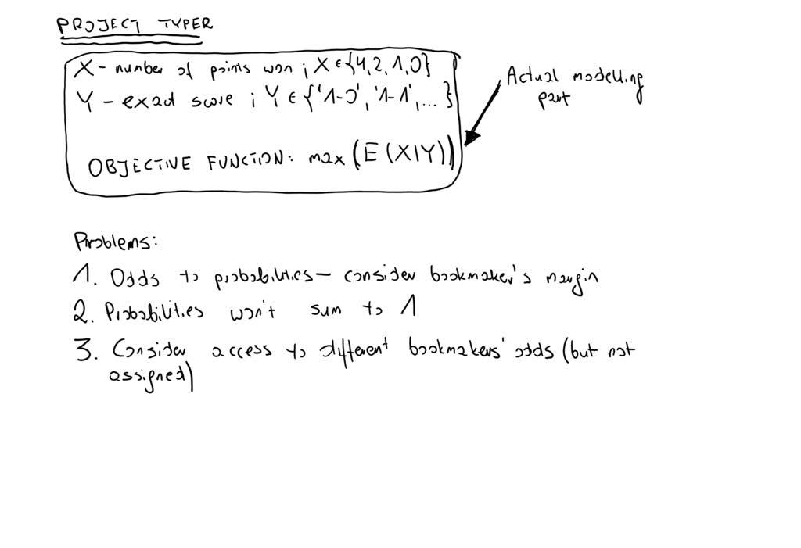

# Project typer
Small scripts for internal World Cup 2018 betting contest. The result is expected value of points for given bet.

To get the results you have to run **choose_bet.R** with 3 parameters:

- URL to [oddschecker bets](https://www.oddschecker.com/) for correct scores bets
- number of bets to include (e.g 10 most probable or all)
- indicator whether to adjust probabilities or not


```bash
Rscript --vanilla https://www.oddschecker.com/football/world-cup/england-v-belgium/correct-score 10 no
```

Some pictures of coneptual work are shown below.


